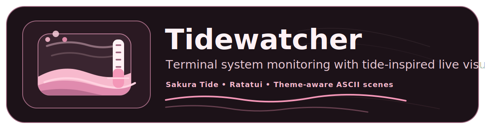
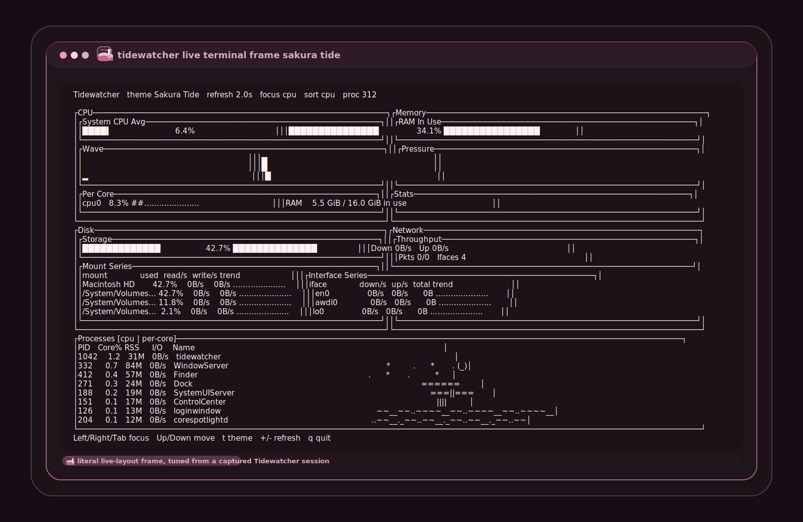

<p align="center">
  
</p>

<p align="center">
  A polished terminal system monitor with tide-inspired live charts, accurate system metrics, and theme-aware ASCII motion.
</p>

<p align="center">
  
  
  
  
  
  
</p>

## Overview

Tidewatcher is a Ratatui-powered terminal dashboard for watching CPU, memory, disks, network activity, and the busiest local processes in one place. It is designed to feel more intentional than a raw diagnostics tool without losing the details that matter when you are actually tracking system behavior.

The current build already includes live history, process actions, multiple curated themes, and a theme-aware animated tide scene that changes with the visual style you choose.

<p align="center">
  
</p>

## Highlights

- Whole-machine CPU, per-core usage, and top-process visibility in one dashboard
- Memory readouts that distinguish in-use, reusable-available, free, and swap
- Per-mount disk activity and per-interface network activity with rolling history
- Sortable process table with a dedicated detail modal plus `TERM` and `KILL` actions
- Theme-aware animated ASCII art integrated into the process panel
- `Sakura Tide` is now the default visual theme for fresh installs
- Built-in themes: `Ocean Current`, `Harbor Fog`, `Sakura Tide`, `Matcha Glass`, `Lantern Ember`, `Moonlit Koi`, and `Winter Plum`
- Native macOS fallbacks for RAM and per-process CPU accuracy where `sysinfo` is not sufficient
- Responsive layout that degrades cleanly on smaller terminals instead of falling apart

## Why Tidewatcher

- It stays terminal-native. No daemon, no browser tab, no detached UI stack.
- It keeps the dashboard expressive without turning the numbers into decoration.
- It is already structured around real operator workflows: scan the overview, sort processes, inspect a target, act on it, move on.

## Install

### Build from source

```bash
cargo build --release
./target/release/tidewatcher
```

### Run in development

```bash
cargo run
```

For normal use, prefer `cargo run --release` or the compiled binary from `target/release/`.

## Configuration

Tidewatcher reads the first configuration file it finds in this order:

1. `$TIDEWATCHER_CONFIG`
2. `./tidewatcher.toml`
3. `~/.config/tidewatcher/config.toml`

See [tidewatcher.toml.example](./tidewatcher.toml.example) for a starter file.

### Supported keys

| Key | Default | Notes |
| --- | --- | --- |
| `refresh_interval_ms` | `2000` | Metric refresh cadence, clamped to `250..10000` |
| `animation_interval_ms` | `180` | Tide animation cadence, clamped to `80..1000` |
| `history_capacity` | `60` | Samples retained per history series, clamped to `20..240` |
| `theme` | `Sakura Tide` | Any built-in theme name |
| `process_sort` | `cpu` | `cpu`, `memory`, `io`, or `name` |
| `disk_limit` | `4` | Max visible disk or mount rows, clamped to `1..8` |
| `network_limit` | `4` | Max visible network rows, clamped to `1..8` |

Unknown keys are ignored with a startup warning. Invalid numeric values are clamped after parsing.

### Example

```toml
refresh_interval_ms = 1500
animation_interval_ms = 180
history_capacity = 90
theme = "Sakura Tide"
process_sort = "cpu"
disk_limit = 4
network_limit = 4
```

## Controls

| Key | Action |
| --- | --- |
| `q` | Quit |
| `Esc` | Quit, or close process detail if it is open |
| `Left` / `Right` / `Tab` / `Shift+Tab` | Switch focused panel |
| `Up` / `Down` | Move focus, or move process selection when the process panel or detail modal is active |
| `t` | Cycle theme |
| `+` / `=` | Refresh faster |
| `-` | Refresh slower |
| `s` | Cycle process sort when the process panel or detail modal is active |
| `Enter` | Open process detail for the selected process, or close it when already open |
| `x` | Send `TERM` to the selected process from detail mode |
| `k` | Send `KILL` to the selected process from detail mode |

## Metric Notes

> The top `CPU` gauge is whole-machine average usage from `0-100%`.
>
> Process `CPU%` is per-process core percentage sampled over the refresh interval. It will not sum directly to the global CPU gauge and can exceed `100%` for multi-threaded processes.
>
> In the memory panel, `RAM` means in use, `Avail` means reusable, `Free` means unallocated, and `Swap` means swap currently in use.
>
> On macOS, Tidewatcher uses native Mach VM counters and `proc_taskinfo` CPU deltas to avoid misleading memory and process CPU readings.

## Platform Notes

| Platform | Status | Metrics Path | Notes |
| --- | --- | --- | --- |
| macOS | Supported | `sysinfo` + native fallbacks | Current primary development target. Uses Mach VM counters and `proc_taskinfo` CPU deltas for better RAM and per-process CPU accuracy. |
| Linux | Expected to work | `sysinfo` | No macOS-only blockers in the main app path. Uses the standard cross-platform metrics path. |
| Windows | Unvalidated | `sysinfo` | No dedicated Windows tuning yet. Process signal actions may be unavailable depending on platform support. |
| WSL | Likely workable | `sysinfo` | Should behave more like Linux than native Windows, but it has not been validated in this repo. |

- macOS is the most tuned platform today.
- Linux should run through the normal cross-platform metrics path, but it still needs explicit validation.
- Windows and WSL are not being advertised as fully supported yet.

## Project Docs

- Product requirements: [PRD.md](./PRD.md)
- Example configuration: [tidewatcher.toml.example](./tidewatcher.toml.example)

## Brand Assets

- Social preview card: [assets/tidewatcher-social-preview.svg](./assets/tidewatcher-social-preview.svg)
- Terminal screenshot frame: [assets/tidewatcher-terminal-frame.svg](./assets/tidewatcher-terminal-frame.svg)
- Logo lockup: [assets/tidewatcher-logo.svg](./assets/tidewatcher-logo.svg)
- Logo mark: [assets/tidewatcher-mark.svg](./assets/tidewatcher-mark.svg)

## Status

Tidewatcher is already functional for daily terminal monitoring, but it is still early in the project lifecycle. The current emphasis is polish, packaging, deeper process controls, and broader platform validation.
